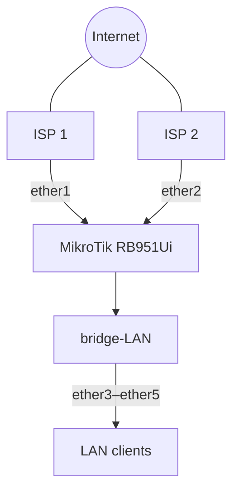

# MikroTik Dual-WAN Load Balancing & Failover

A hands-on networking project built on a MikroTik RB951Ui. The project establishes a dual-WAN foundation with a single bridged LAN, DHCP, NAT, and independent ISP connectivity. PCC load balancing and automatic failover are the next implementation and validation stages.

> **Current state:** LAN, DHCP, both WAN DHCP clients, per-WAN NAT, and independent ISP testing are complete. PCC rules, route health checks, automatic failover, and final evidence are not yet complete.

## Project objectives

- Connect two independent internet service providers.
- Provide one internal network across three physical LAN ports.
- Assign client addresses automatically with DHCP.
- Translate private client addresses through the selected WAN using NAT.
- Distribute new connections between both ISPs with PCC.
- Preserve connectivity when either WAN becomes unavailable.
- Document the implementation, tests, problems, and lessons learned.

## Environment

| Component | Configuration |
|---|---|
| Router | MikroTik RB951Ui |
| Management | WinBox and RouterOS terminal |
| WAN 1 | `ether1` |
| WAN 2 | `ether2` |
| LAN ports | `ether3`, `ether4`, `ether5` |
| LAN bridge | `bridge-LAN` |
| Router LAN address | `192.168.10.1/24` |
| LAN network | `192.168.10.0/24` |
| Client addressing | DHCP |

## Architecture

The WAN interfaces remain outside `bridge-LAN`. Only `ether3` through `ether5` belong to the internal bridge.

## Implementation progress

| Stage | Status | Evidence |
|---|---|---|
| Interface assignment | Complete | Configuration documented |
| LAN bridge | Complete | `bridge-LAN` on `ether3–ether5` |
| LAN gateway | Complete | `192.168.10.1/24` |
| DHCP server | Complete | Clients receive `192.168.10.x` addresses |
| WAN 1 DHCP client | Complete | Bound and independently tested |
| WAN 2 DHCP client | Complete | Bound and independently tested |
| Source NAT | Complete | Masquerade rule for each WAN |
| PCC load balancing | Pending | Design documented; rules not verified |
| WAN health checks | Pending | Test method to be finalized |
| Automatic failover | Pending | Failure and recovery tests not completed |
| Sanitized export | Pending | To be added after final validation |
| Screenshots | Pending | Evidence checklist prepared |

## How the current network works

1. A LAN device connects through `ether3`, `ether4`, or `ether5`.
2. `bridge-LAN` places those ports on the same logical network.
3. DHCP assigns the device an address in `192.168.10.0/24`.
4. The client uses `192.168.10.1` as its default gateway.
5. A masquerade rule translates the private source address for the selected WAN.
6. Each ISP can currently be tested independently before advanced routing is introduced.

## Planned PCC behavior

PCC classifies **connections**, not individual packets. A connection remains on its assigned WAN path while other connections may use the second WAN.

| Example connection | Assigned path |
|---|---|
| Connection 1 | WAN 1 |
| Connection 2 | WAN 2 |
| Connection 3 | WAN 1 |
| Connection 4 | WAN 2 |

Two 5 Mbps links can provide roughly 10 Mbps of aggregate capacity across multiple simultaneous connections. One single download will not normally combine both links into a 10 Mbps stream.

## Planned failover behavior

| Network condition | Expected routing behavior |
|---|---|
| WAN 1 and WAN 2 healthy | PCC distributes new connections |
| WAN 1 unavailable | Traffic uses WAN 2 |
| WAN 2 unavailable | Traffic uses WAN 1 |
| Failed WAN restored | Router returns to normal dual-WAN behavior |

A physical link being up does not prove that the internet path is healthy. The final configuration therefore needs an upstream reachability test and failover-aware routes.

## Testing approach

The project follows a layered troubleshooting sequence:

Each stage must work before the next one is introduced. External reachability should be checked against more than one reliable target because a single host may block or fail to answer ICMP even when the WAN path is usable.

## Documentation

| Document | Purpose |
|---|---|
| [Network design](docs/01-network-design.md) | Physical and logical topology |
| [LAN configuration](docs/02-lan-configuration.md) | Bridge, IP addressing, and DHCP |
| [WAN configuration](docs/03-wan-configuration.md) | Dual DHCP-client setup and independent tests |
| [NAT configuration](docs/04-nat-configuration.md) | Per-WAN masquerade rules |
| [PCC load balancing](docs/05-pcc-load-balancing.md) | PCC concepts, prerequisites, and validation plan |
| [WAN failover](docs/06-failover.md) | Health-check and failure-testing design |
| [Testing and troubleshooting](docs/07-testing-troubleshooting.md) | Layered verification workflow |
| [Lessons learned](lessons-learned.md) | Practical engineering takeaways |
| [Configuration exports](configs/README.md) | Sanitization requirements and planned exports |
| [Evidence checklist](evidence/README.md) | Screenshots and test artifacts to collect |
| [Diagram guide](diagrams/README.md) | Planned visual assets |

## Security and publication rules

Before any RouterOS export or screenshot is published:

- Remove usernames, passwords, API tokens, private keys, and shared secrets.
- Remove ISP credentials and authentication details.
- Review public IP addresses, serial numbers, MAC addresses, and device identities.
- Use `/export hide-sensitive` where supported, then inspect the output manually.
- Never assume automatic sanitization removed every sensitive value.

## Skills demonstrated

- MikroTik RouterOS and WinBox
- Ethernet interface assignment
- Network bridging
- IPv4 subnetting and default gateways
- DHCP client and server configuration
- Source NAT and masquerading
- Dual-WAN architecture
- PCC load-balancing concepts
- WAN failover design
- Layered network troubleshooting
- Technical documentation

## Next milestones

- [ ] Implement and verify PCC connection marking.
- [ ] Create the required routing tables and routes.
- [ ] Configure upstream WAN health checks.
- [ ] Test WAN 1 failure and recovery.
- [ ] Test WAN 2 failure and recovery.
- [ ] Validate connection distribution across both WANs.
- [ ] Add a reviewed, sanitized RouterOS export.
- [ ] Add screenshots and test evidence.
- [ ] Update the project status from design to verified implementation.
